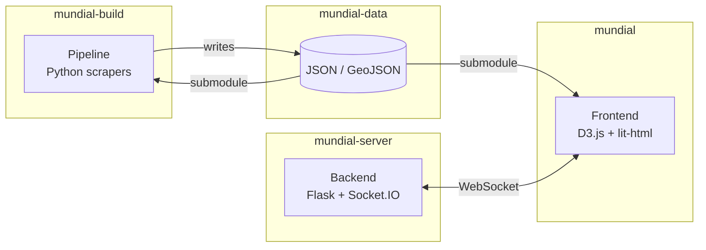

# Born In, Plays For

Interactive visualisation of the 2026 FIFA World Cup tracking player "exports": players born in one country who represent another.

**Live at [mundial.cthiebaud.com](https://mundial.cthiebaud.com/)**

## Repositories

| Repo | Purpose |
|---|---|
| [mundial](https://github.com/born-in-plays-for/mundial) | Static frontend — D3.js choropleth map, Elo rankings, live game page, infographics |
| [mundial-data](https://github.com/born-in-plays-for/mundial-data) | Shared data files (JSON, GeoJSON) — git submodule consumed by both mundial and mundial-build |
| [mundial-build](https://github.com/born-in-plays-for/mundial-build) | Data pipeline — Python scrapers, CSV processing, JSON generation |
| [mundial-server](https://github.com/born-in-plays-for/mundial-server) | Backend — Flask API, Google Sign-In, WebSocket, API-Football proxy |

## Architecture

