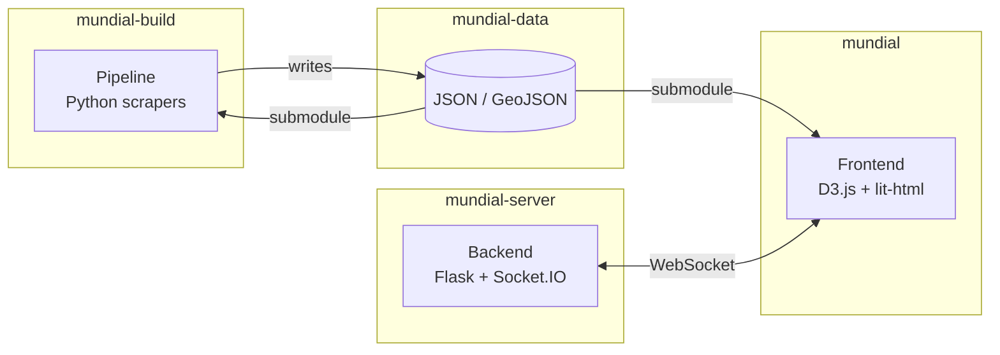
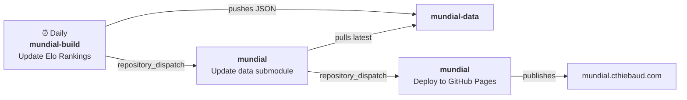

# Born In, Plays For

Interactive visualisation of the 2026 FIFA World Cup tracking player "exports": players born in one country who represent another.

**Live at [mundial.cthiebaud.com](https://mundial.cthiebaud.com/)**

## Repositories

| Repo | Purpose |
|---|---|
| [mundial](https://github.com/born-in-plays-for/mundial) | Static frontend — D3.js choropleth map, Elo rankings, live game page |
| [mundial-data](https://github.com/born-in-plays-for/mundial-data) | Shared data files (JSON, GeoJSON) — git submodule consumed by both mundial and mundial-build |
| [mundial-build](https://github.com/born-in-plays-for/mundial-build) | Data pipeline — Python scrapers, CSV processing, JSON generation |
| [mundial-server](https://github.com/born-in-plays-for/mundial-server) | Backend — Flask API, Google Sign-In, WebSocket, API-Football proxy |

## Architecture

## CI / GitHub Actions

| Workflow | Repo | Trigger | What it does |
|---|---|---|---|
| Update Elo Rankings | mundial-build | Daily / manual | Scrapes eloratings.net, pushes to mundial-data, dispatches to mundial |
| Update data submodule | mundial | `repository_dispatch` / manual | Pulls latest mundial-data, commits new submodule pointer, triggers deploy |
| Deploy to GitHub Pages | mundial | `repository_dispatch` from Update data submodule / Push to main / manual | Deploys site (data submodule cached for fast code-only deploys) |

**Automated flow**: The entire pipeline from Elo update through live site deployment is fully automated. New Elo data triggers a dispatch to `mundial` → submodule updates → GitHub Pages redeploys with new data — no manual steps required.

Cross-repo actions use a fine-grained PAT (`MUNDIAL_DISPATCH_TOKEN` secret on mundial-build) with Contents write access to mundial and mundial-data.
